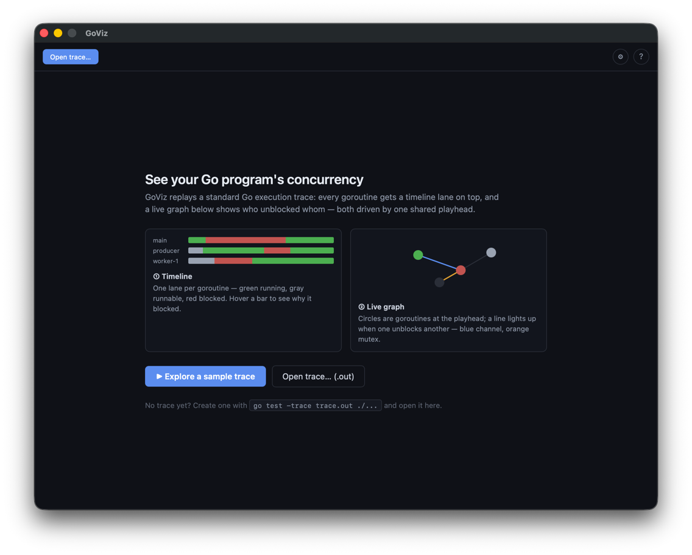
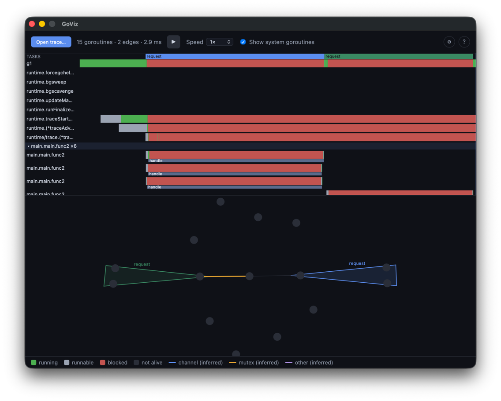

# GoViz

A desktop tool for **seeing** Go concurrency. `goviz` reads a standard Go execution trace and renders it as a **hybrid view**: a goroutine timeline on top and a live, force-directed goroutine graph below — both driven by a single, scrubbable playhead. Press play and watch goroutines run, block, and unblock each other over time.

It is built on the same official trace data that `go tool trace` consumes (produced by `runtime/trace`), so it works with any Go 1.22+ program **without patching the runtime**.

## Why

The inspiration, [divan/gotrace](https://github.com/divan/gotrace), made goroutine concurrency wonderfully tangible — but it patched the Go runtime to collect events, and that approach broke with each Go release and became unmaintained. `goviz` deliberately uses only the stable, public Go 1.22+ execution-trace format (via `golang.org/x/exp/trace`), trading some richness for longevity.

## Features

- **Timeline** — one lane per goroutine; colored segments for running / runnable / blocked state; hover an interval to see its block reason (e.g. `chan receive`).
- **Live graph** — goroutines as nodes colored by their state *at the current playhead*, connected by inferred causal edges; edges light up when they fire near the playhead.
- **Playback** — play / pause / scrub / speed (0.25×–4×), Space to toggle. The timeline and graph stay in lockstep on one shared playhead.
- **Focus** — parked `runtime.*` system goroutines are hidden by default (toggle to show); click a goroutine to cross-highlight it in both views.

### Start screen



Before a trace is loaded, GoViz explains its two panels — the timeline and the live graph — and offers two ways in: **Explore a sample trace** runs a built-in workload so you can try the app immediately, or **Open trace… (.out)** loads a trace you produced with `go test -trace trace.out ./...`.

### Hybrid view (trace loaded)



The top half is the **timeline** — one lane per goroutine, with green/gray/red segments for running / runnable / blocked, grouped by their start function (e.g. `main.main.func2 ×6`) and annotated with user tasks (`request`) and regions (`handle`). The bottom half is the **live graph** — each goroutine is a node colored by its state *at the playhead*, and a causal edge lights up (blue = channel, orange = mutex) when one goroutine unblocks another; task members are wrapped in a shared hull. The header shows trace stats (`15 goroutines · 2 edges · 2.9 ms`), play/scrub controls, speed, and the *Show system goroutines* toggle; the bottom legend decodes every color.

## Honest limitations

The Go execution trace records *that* one goroutine unblocked another and *why it was blocked* (channel, mutex, …), but it does **not** record channel identities or transferred values. So causal edges are **inferred** — the UI labels them "(inferred)" rather than claiming a specific channel. Goroutines that stay parked for the whole trace (many runtime internals) only appear at the trace's end, because that's all the trace says about them.

## Requirements

- Go 1.26+ (the module's `go` directive; trace *format* support is Go 1.22+)
- [Wails v2](https://wails.io) CLI, Node.js, and a C toolchain (for building the desktop app)

## Build & run

```bash
# Desktop app (hot-reloading dev, or a packaged build)
wails dev
wails build      # → build/bin/goviz.app

# Inspect a trace's parsed summary as JSON, no GUI needed
go run ./cmd/tracedump path/to/trace.out
```

### Producing a trace to open

Run any program (or test) with the execution tracer enabled, then open the resulting file from the app:

```go
import "runtime/trace"

f, _ := os.Create("trace.out")
trace.Start(f)
defer trace.Stop()
// ... your concurrent code ...
```

or `go test -trace trace.out ./...`. Then launch the app and choose **Open trace…**.

## How it works

```
trace.out → internal/parse → model.TraceSummary (JSON) → Wails binding
          → frontend store → pure view logic (src/lib) → canvas renderers
```

The Go side parses the trace into a fully rendering-ready `TraceSummary` (goroutine timelines + inferred causal edges) in a single forward pass; the frontend never re-parses. View math (time/pixel scales, layout, hit-testing, the at-time-t state) lives in small, unit-tested TypeScript modules, while the Svelte canvas components stay thin.

## Tech stack

Go (parsing) · [Wails v2](https://wails.io) (desktop shell) · Svelte + TypeScript + Vite · HTML Canvas · [d3-force](https://github.com/d3/d3-force) (graph layout).

## Development

```bash
go test ./...                  # Go tests
cd frontend && npm test        # frontend (Vitest) unit tests
cd frontend && npm run check   # svelte-check type-check
```

See [CLAUDE.md](CLAUDE.md) for architecture details and contributor conventions; design specs and implementation plans live under `docs/superpowers/`.

## Status

The v1 hybrid visualization is functionally complete. Possible future work: edge "flash" animation, graph zoom/pan, and WebGL rendering for very large traces (thousands of goroutines).
